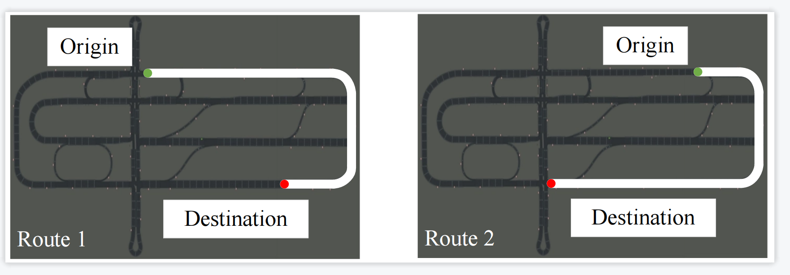
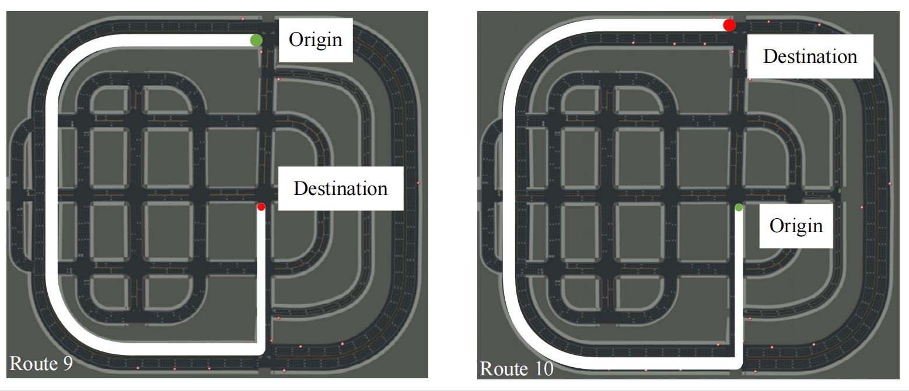

# AUTO : A Hierarchical Decision-making Framework with Multi-modality Perception for Autonomous Driving


This repo is the implementation of the following paper:

**AUTO : A Hierarchical Decision-making Framework with Multi-modality Perception for Autonomous Driving**  

The figure shows the architecture of our framework, which consists of five components: data preprocessing, state representation, actorcritic,
hybrid reward function, and multi-worker training. For the data preprocessing,we first take the data from HD maps and multiple
sensors (i.e., Camera, LiDAR, GNSS, and IMU) as input, based on which we respectively extract the feature vectors of lanes, vehicles,
and traffic lights from it and finally generate a multi-modality state for the agent. For the state representation,we propose a lane-wised
cross attention model (LCA) to learn a latent representation of the state features. It organizes as multiple agent-centric star graphs
and applies cross attention to aggregate multi-modality features on each lane. Then, the aggregated results of each lane are fused as a
state representation. For the actor-critic, we first introduce LCA for the actor and critic, respectively. Then, we compute an action 𝑎𝑡
using a hierarchical action structure that first decides whether to perform a lane-changing decision (high level) and then compute an
exact action to execute (low level). For the hybrid reward function, we calculate a reward value for action and state, which
serves as a signal to guide the agent to learn an optimal action policy. For the multi-worker training, we speed up the training of actorcritic
and improve the convergence performance using distributed computation.
<br> 

<br> 

## Code Structure
- algs<br>
    - pdqn<br>
       Implementaion for our reinforcement learning algorithm, including lane-wised cross attention model (LCA), 
       actor-critic model and hierarchical action. Class "lane_wise_cross_attention_encoder" is the LCA network,
       Class "PolicyNet_multi" is the actor network, Class "QValueNet_multi" is the critic network.
       Class P_DQN includes a whole workflow of reinforcement learning, including action section and gradient update.
    - replay_buffer<br>
       relay buffer of our reinforcement learning, which is used to store experiences and sample experiences.  
       
- gym_carla<br>
Gym-like carla environment for vehicle agent controlled by reinforcement learning.
    - carla_env.py<br>
    Main module for Gym-like Carla environment, which shares the same APIs as classical [Gym](https://gymnasium.farama.org/).
    Function "reset" is an initialization at the beginning of an episode and Function "step" includes state generation and reward calculation.
    - settings.py<br>
    This module contains environment parameter list for carla_env. For example,  
    the detection range $D_{tl}$ of traffic lights by the camera: $50𝑚$,  
    the detection range $D_v$ of conventional vehicles by LiDAR: $70𝑚$,  
    the number $n$ of waypoints observed by the autonomous vehicle: $10$,  
    the time interval $\Delta t$ between two decisions: $0.1𝑠$,  
    the TTC threshold $\mathcal{G}$ in the safety reward: $4𝑠$,  
    the acceleration threshold $acc_{thr}$ in the comfort reward: $3𝑚/𝑠^2$,  
    the velocity change threshold $vel_{thr}$ in the impact reward: $0.1𝑚/𝑠$, 
    - agent
        - basic_agent.py<br>
         BasicAgent implements an algorithm that navigates the scene.
        - basic_lane_change_agent.py<br>
        Basic lane-changing model for agent with several rules.
        - behavior_types.py<br>
        This module contains different parameters sets for each behavior. 
        - global_planner.py<br>
        This module provides a high level route plan, which set a global map route for each vehicle.
        - pid_controller.py<br>
        This module contains PID controllers to perform lateral and longitudinal control. 
    - util
        - misc.py<br>
        This file contains auxiliary functions used in Carla. For example, a route calculation function, a distance calculation,
         a waypoint selection function, and so on. 
        - render.py<br>
        This enables the rendering of front-eye camera view of ego vehicle in one pygame window. 
        - bridge_functions.py<br>
        This file includes transfer functions for onboard sensors.  
        - extended_kalman_filter<br>
        This file implements the extended kalman_filter function.  
        - geometric_functions.py<br>
        This file implements the orientation transformation of vehicles.
        - sensor.py<br>
        This file implements sensor-related functions and classes.
        - wrapper.py<br>
        This file contains auxiliary functions and classes for carla_env. It includes specific state collection functions and reward calculation functions.
- main
    - tester<br>
    Code for testing our reinforcement learning model.
    - trainer<br>
    Code for training our reinforcement learning model.  
    - process.py<br>
    Two functions that are used to start a process or kill a process. 

 

## Getting started
1. Install and setup [the CARLA simulator (0.9.14)](https://carla.readthedocs.io/en/latest/start_quickstart/#a-debian-carla-installation), set the executable CARLA_PATH in gym_carla/setting.py

2. Setup conda environment with cuda 11.7
```shell
$ conda create -n env_name python=3.7
$ conda activate env_name
```
3. Clone the repo and Install the dependent package
```shell
$ git clone https://github.com/xiayuyang/AUTO.git
$ pip install -r requirements.txt
```
4. Train the RL agent in the multi-lane scenario
```shell
$ python ./main/trainer/pdqn_multi_process.py
```
5. Test the RL agent in the multi-lane scenario
```shell
$ python ./main/tester/multi_lane_test.py
```

## Training performance


## a video example


## some route examples




## Reference


## License
All code within this repository is under [Apache License 2.0](https://www.apache.org/licenses/LICENSE-2.0).

## Acknowledgements
Our code is based on several repositories:
- [gym-carla](https://github.com/cjy1992/gym-carla.git)
- [CARLA_Leaderboard](https://github.com/RobeSafe-UAH/CARLA_Leaderboard.git)
- [MP-DQN](https://github.com/cycraig/MP-DQN.git)
