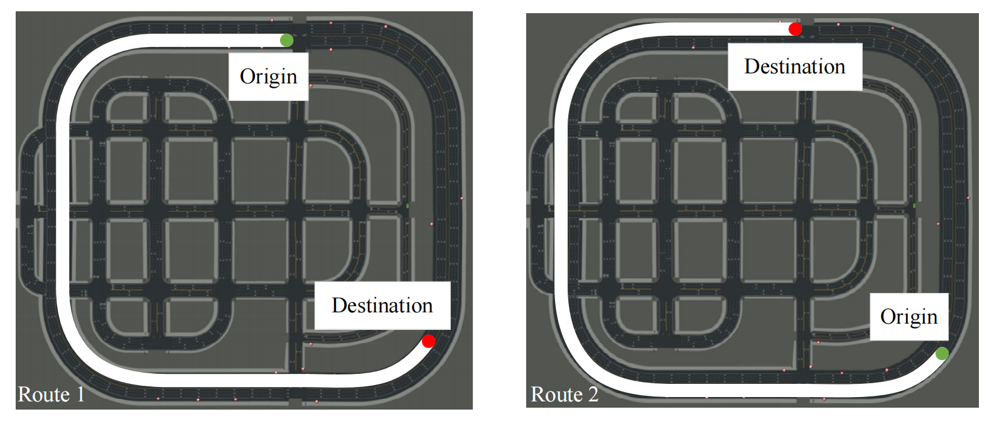
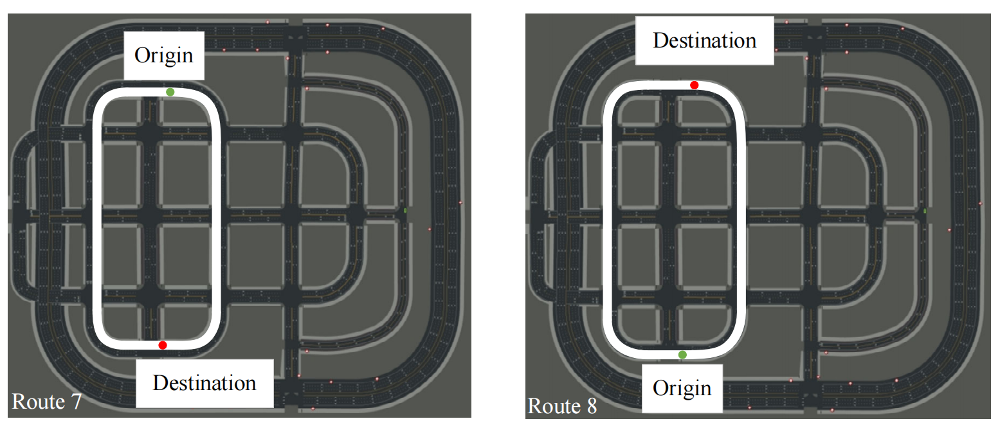

# AUTO : A Hierarchical Decision-making Framework with Multi-modality Perception for Autonomous Driving


This repo is the implementation of the following paper:

**AUTO : A Hierarchical Decision-making Framework with Multi-modality Perception for Autonomous Driving**

<br> 

<br> 

## Code Structure
- algs<br>
Implementaion for algorithims.
- gym_carla<br>
Gym-like carla environment for vehicle agent controlled by reinforcement learning.
    - agent
        - basic_agent.py<br>
         BasicAgent implements an agent that navigates the scene.This agent respects traffic lights and other vehicles, but ignores stop signs.
        - basic_lane_change_agent.py<br>
        Basic lane change model for vehicle agent controlled by rule.
        - behavior_agent.py<br>
        BehaviorAgent implements an agent that navigates scenes to reach a given
        target destination, by computing the shortest possible path to it.
        This agent can correctly follow traffic signs, speed limitations,
        traffic lights, while also taking into account nearby vehicles. Lane changing
        decisions can be taken by analyzing the surrounding environment such as tailgating avoidance.Adding to these are possible behaviors, the agent can also keep safety distance from a car in front of it by tracking the instantaneous time to collision and keeping it in a certain range. Finally, different sets of behaviors are encoded in the agent, from cautious to a more aggressive ones.
        - behavior_types.py<br>
        This module contains the different parameters sets for each behavior. 
        - global_planner.py<br>
        This module provides a very high level route plan, which set the global map route for vehicles.
        - local_planner.py<br>
        LocalPlanner implements the basic behavior of following a
        trajectory of waypoints that is generated on-the-fly.<br>
        The low-level motion of the vehicle is computed by using two PID controllers,
        one is used for the lateral control and the other for the longitudinal control (cruise speed).<br>
        When multiple paths are available (intersections) this local planner makes a random choice,unless a given global plan has already been specified.
        - pid_controller.py<br>
        This module contains PID controllers to perform lateral and longitudinal control. 
    - util
        - misc.py<br>
        This module contains auxiliary functions used in Carla.
        - render.py<br>
        This module enables the rendering of front-eye camera view of ego vehicle in one pygame window. 
        - sensor.py<br>
        This module implement sensor-related functions and classes.
        - wrapper.py<br>
        This module contains auxiliary functions and classes for carla_env.
    - carla_env.py<br>
    Main module for Gym-like Carla environment, which shares the same APIs as classical [Gym](https://gymnasium.farama.org/).
    - settings.py<br>
    This module contains environment parameter list for carla_env.
- main
    - tester<br>
    Code for testing model performance.
    - trainer<br>
    Code for training reinforcement learning model.
## Getting started
1. Install and setup [the CARLA simulator (0.9.14)](https://carla.readthedocs.io/en/latest/start_quickstart/#a-debian-carla-installation), set the executable CARLA_PATH in gym_carla/setting.py

2. Setup conda environment with cuda 11.7
```shell
$ conda create -n env_name python=3.7
$ conda activate env_name
```
3. Clone the repo and Install the dependent package
```shell
$ git clone https://github.com/greenday12138/AUTO.git
$ pip install -r requirements.txt
```
4. Train the RL agent in the multi-lane scenario
```shell
$ python ./main/trainer/pdqn_multi_process.py
```
5. Test the RL agent in the multi-lane scenario
```shell
$ python ./main/tester/multi_lane_test.py
```

## Training performance


## Scenario Test
### Lane Change Scenario


### Traffic Light Scenario


## Scenario Setting
### Highway Route


### Urban Route







## Reference


## License
All code within this repository is under [Apache License 2.0](https://www.apache.org/licenses/LICENSE-2.0).

## Acknowledgements
Our code is based on several repositories:
- [gym-carla](https://github.com/cjy1992/gym-carla.git)
- [CARLA_Leaderboard](https://github.com/RobeSafe-UAH/CARLA_Leaderboard.git)
- [MP-DQN](https://github.com/cycraig/MP-DQN.git)
